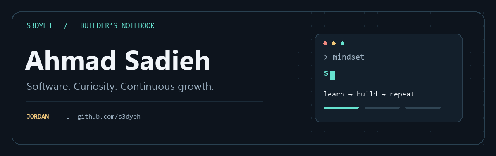
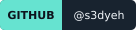
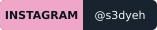
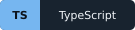
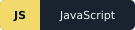
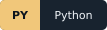
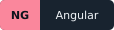
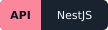

  

<h1 align="center">Hey, I'm Ahmad 👋</h1>

  <strong>Building useful software. Learning deeply. Getting better every day.</strong> 
  A developer from Jordan exploring full-stack applications, practical AI, and better ways to learn.

  
  
  

  <a href="#about-me">About</a> ·
  <a href="#selected-projects">Projects</a> ·
  <a href="#my-toolbox">Toolbox</a> ·
  <a href="#on-my-workbench">Workbench</a> ·
  <a href="#lets-connect">Connect</a>

---

## About me

I'm **Ahmad Sadieh**, known online as **s3dyeh**. I enjoy turning an idea into something people can actually use, then going back to understand how to make it clearer, more reliable, and more enjoyable.

My projects range from web application foundations to small developer tools. Lately, I've also been exploring AI-assisted career tools and interactive experiences that help people understand Git and GitHub through practice.

Personal growth matters to me as much as technical growth. This profile is a place to share what I'm building, what I'm exploring, and the lessons I pick up along the way.

- **What draws me in:** useful products, thoughtful interfaces, and the systems behind them.
- **What I'm exploring:** full-stack architecture, practical AI workflows, and interactive learning.
- **What keeps me going:** the chance to understand something better and turn that understanding into working software.

> Stay curious. Build with intention. Keep improving.

## Selected projects

### 01 · SaaS application foundation

**[Enterprise Angular & NestJS Monorepo →](https://github.com/s3dyeh/Enterprise-Angular-NestJS-Monorepo)**

A foundation for full-stack applications with Angular, NestJS, PostgreSQL, and Redis. The repository brings together authentication, workspaces, invitations, access control, and deployment configuration.

**Explore it for:** application structure, shared contracts, English/Arabic navigation, and the connection between the frontend, API, and data layer.

`Angular` · `NestJS` · `TypeScript` · `PostgreSQL` · `Redis`

### 02 · A little more color in the terminal

**[Node.js CLI Colorizer Light →](https://github.com/s3dyeh/Node.js-CLI-Colorizer-Light)**

A JavaScript tool for making command-line output easier to read, with themes, semantic logging, styled tables, and chainable methods.

**Explore it for:** small developer-experience improvements that make everyday tools more pleasant to use.

`JavaScript` · `Node.js` · `CLI tooling`

### 03 · Nurse On Call

**[NOC →](https://github.com/s3dyeh/NOC)**

A Python project organized around Nurse On Call, with application modules for appointments, users, notifications, and more.

**Explore it for:** another side of my application-building journey and a look at the repository's structure.

`Python` · `Web applications`

  <a href="https://github.com/s3dyeh?tab=repositories"><strong>Browse all my repositories →</strong></a>

## My toolbox

Technologies represented across my public projects and current experiments:

**Languages**

  
  
  

**Interfaces & APIs**

  
  
